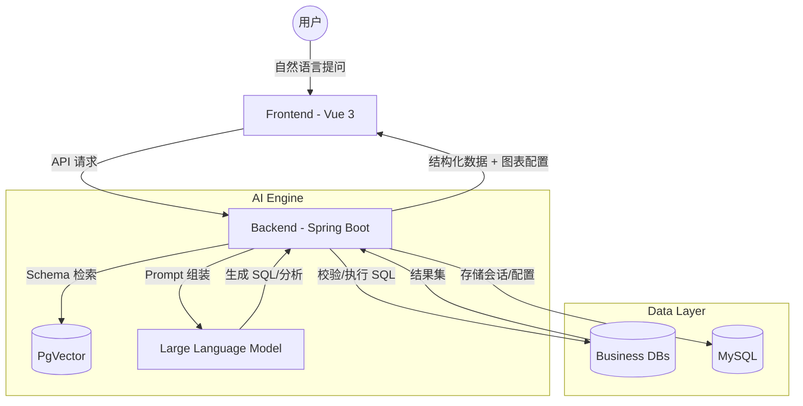

# MySqlBot 🤖

基于 LLM + RAG 的企业级 Text-to-SQL 智能数据问答系统。

[](https://www.oracle.com/java/)
[](https://spring.io/projects/spring-boot)
[](https://spring.io/projects/spring-ai)
[](https://vuejs.org/)
[](LICENSE)

MySqlBot 是一个智能数据分析助手，旨在让非技术人员通过自然语言即可直接查询数据库，获取可视化报表及业务洞察。它结合了最新的大语言模型（LLM）与 RAG（检索增强生成）技术，确保生成的 SQL 既准确又安全。

---

## ✨ 核心特性

- 🔍 **智能 Text-to-SQL**: 通过自然语言提问生成精准的 SQL 查询。
- 📚 **RAG 增强 Schema 检索**: 自动提取表结构并向量化，智能检索最相关的表和字段，解决长上下文导致的 LLM 幻觉问题。
- 📊 **智能图表生成**: 自动推荐并渲染最适合的数据图表（柱状图、折线图、饼图等），基于 ECharts 实现。
- 💡 **数据洞察与总结**: 自动分析查询结果，提取关键业务信息并给出文字总结。
- 🛡️ **安全沙箱**:
  - **JSqlParser 校验**: 强制仅允许执行 `SELECT` 语句。
  - **行级权限 (RLS)**: 基于 LLM 驱动的权限重写逻辑，确保用户只能查看授权范围内的数据。
  - **资源限制**: 限制查询超时时间及结果集最大行数。
- 🔄 **Few-Shot 增强**: 支持 SQL 案例库，生成 SQL 时自动查找相似历史案例供模型参考。
- 📝 **提示词模板优化**: 基于结构化指令（Instruction/Rules/Process）深度优化 Prompt，大幅提升 MySQL/PostgreSQL 生成准确度。
- 🔄 **自愈重试机制**: SQL 执行失败时自动捕获错误并反馈给 LLM 进行自我修正，重试上限可配。
- 💬 **上下文对话**: 支持多轮对话，根据上下文不断深入挖掘数据，支持会话重命名与删除。
- 🚀 **多数据源管理**: 动态连接并切换 MySQL/PostgreSQL 数据源，支持手动同步 Schema。

---

## 🛠️ 技术栈

### 后端 (Backend)
- **核心框架**: Spring Boot 3.3.5
- **人工智能**: Spring AI (OpenAI 协议，支持 DeepSeek, GPT-4, 通义千问等)
- **向量数据库**: PgVector (PostgreSQL 扩展)
- **数据库**: MySQL 8.0 (配置存储), 多种目标数据库 (MySQL/PostgreSQL)
- **SQL 解析**: JSqlParser
- **其他**: Spring Data JPA, HikariCP, Lombok, Validation

### 前端 (Frontend)
- **框架**: Vue 3 (Composition API)
- **构建工具**: Vite
- **UI 组件**: Element Plus
- **图表库**: ECharts
- **状态管理**: Pinia
- **样式**: TailwindCSS (部分集成)
- **渲染**: Markdown-it, Highlight.js

---

## 🏗️ 架构图



---

## 🚀 快速开始

### 1. 环境准备
- **Java**: 17+
- **Node.js**: 18+
- **MySQL**: 8.0+
- **PostgreSQL**: 需安装 [pgvector](https://github.com/pgvector/pgvector) 扩展

### 2. 数据库配置
1. **MySQL**: 创建数据库 `mysqlbot`，执行 `src/main/resources/db/init.sql` 初始化表结构。
2. **PostgreSQL**: 创建数据库 `mysqlbot_vector`，执行 `src/main/resources/db/pgvector_init.sql`。

### 3. 后端启动
1. 将 `src/main/resources/application-template.yml` 重命名为 `application.yml`。
2. 修改其中的配置，或设置对应的环境变量：
```bash
# AI 配置 (建议使用环境变量)
export ZHIPU_API_KEY=your_api_key

# 数据库配置
export MYSQL_PASSWORD=your_mysql_password
export PG_PASSWORD=your_pg_password
```
3. 运行主类 `MySqlBotApplication`。

### 4. 前端启动
```bash
cd frontend
npm install
npm run dev
```

---

## 📅 下一步计划

- [ ] 完善知识库管理界面（上传业务术语、SQL 案例）。
- [ ] 支持更多图表类型（散点图、雷达图等）。
- [ ] 增强多租户管理功能。
- [ ] 提供导出 PDF/Excel 报表功能。

---

## 🤝 贡献说明

欢迎提交 Pull Request 或 Issue。在参与贡献前，请确保您的代码符合项目的 Lint 规范。

---

## 📄 开源协议

基于 [MIT License](LICENSE) 协议。
