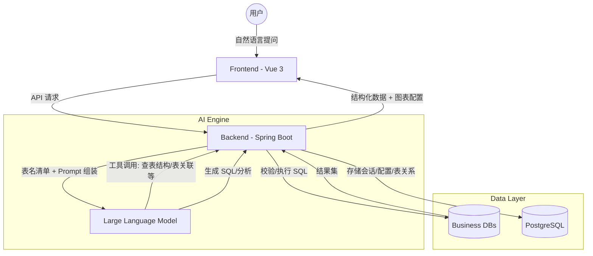

# MySqlBot 🤖

基于 LLM 工具调用的企业级 Text-to-SQL 智能数据问答系统。

[](https://www.oracle.com/java/)
[](https://spring.io/projects/spring-boot)
[](https://www.postgresql.org/)
[](https://vuejs.org/)
[](LICENSE)

MySqlBot 是一个智能数据分析助手，旨在让非技术人员通过自然语言即可直接查询数据库，获取可视化报表及业务洞察。它让大语言模型（LLM）通过工具自行探索数据库结构（表、列、关联关系），按需生成 SQL，确保结果既准确又安全。

---

## ✨ 核心特性

- 🔍 **智能 Text-to-SQL**: 通过自然语言提问生成精准的 SQL 查询。
- 🧭 **LLM 工具驱动的 Schema 探索**: 不预先嵌入 Schema，改由 LLM 通过工具（列出表名、查询表结构、查询表关联、按列名搜表、取样例数据）按需探索数据库，规避长上下文导致的幻觉。
- 📊 **智能图表生成**: 自动推荐并渲染最适合的数据图表（柱状图、折线图、饼图等），基于 ECharts 实现。
- 💡 **数据洞察与总结**: 自动分析查询结果，提取关键业务信息并给出文字总结。
- 🛡️ **安全沙箱**:
  - **JSqlParser 校验**: 强制仅允许执行 `SELECT` 语句。
  - **行级权限 (RLS)**: 基于 LLM 驱动的权限重写逻辑，确保用户只能查看授权范围内的数据。
  - **资源限制**: 限制查询超时时间及结果集最大行数。
- 🔄 **Few-Shot 增强**: 支持 SQL 案例库，生成 SQL 时自动查找相似历史案例供模型参考。
- 📝 **提示词模板优化**: 基于结构化指令（Instruction/Rules/Process）深度优化 Prompt，大幅提升 MySQL/PostgreSQL 生成准确度。
- 🔄 **自愈重试机制**: SQL 执行失败时自动捕获错误并反馈给 LLM 进行自我修正，重试上限可配。
- 💬 **上下文对话**: 支持多轮对话，根据上下文不断深入挖掘数据，支持会话重命名与删除。
- 🚀 **多数据源管理**: 动态连接并切换 MySQL/PostgreSQL 数据源，支持手动同步 Schema。
- 🔗 **表关系智能管理**: Schema 同步时按 外键 / 命名约定 / AI 三种策略自动推断表关联；设置页支持「**AI 自动生成**」一键推断（预览勾选后保存）与**下拉式手动维护**，为多表 JOIN 提供权威依据。

---

## 🛠️ 技术栈

### 后端 (Backend)
- **核心框架**: Spring Boot 3.3.5
- **大模型**: 自研 OpenAI 兼容客户端（默认 DeepSeek；可切换 OpenAI、智谱、通义千问等兼容厂商），支持工具调用（Function Calling）与流式输出
- **数据库**: PostgreSQL (会话/配置/业务数据存储), 目标数据源 (MySQL/PostgreSQL)
- **SQL 解析**: JSqlParser
- **其他**: Spring Data JPA, HikariCP, Lombok, Validation

### 前端 (Frontend)
- **框架**: Vue 3 (Composition API)
- **构建工具**: Vite
- **UI 组件**: Element Plus
- **图表库**: ECharts
- **状态管理**: Pinia
- **样式**: TailwindCSS (部分集成)
- **渲染**: Markdown-it, Highlight.js

---

## 🏗️ 架构图


```mermaid
graph TD
    User((用户)) -->|自然语言提问| Frontend[Frontend - Vue 3]
    Frontend -->|API 请求| Backend[Backend - Spring Boot]
    
    subgraph AI Engine
        Backend -->|表名清单 + Prompt 组装| LLM[Large Language Model]
        LLM -->|工具调用: 查表结构/表关联等| Backend
        LLM -->|生成 SQL/分析| Backend
    end
    
    subgraph Data Layer
        Backend -->|校验/执行 SQL| TargetDB[(Business DBs)]
        Backend -->|存储会话/配置/表关系| AdminDB[(PostgreSQL)]
    end
    
    TargetDB -->|结果集| Backend
    Backend -->|结构化数据 + 图表配置| Frontend
```

---

## 🚀 快速开始

### 1. 环境准备
- **Java**: 21+
- **Node.js**: 18+
- **PostgreSQL**: 12+（无需 pgvector 扩展）

### 2. 数据库配置
唯一数据库为 PostgreSQL，存放会话、消息、数据源配置、术语表、SQL 案例、表关联关系、系统配置等业务表。
```bash
createdb -U postgres mysqlbot
psql -U postgres -d mysqlbot -f src/main/resources/db/init.sql
```
（也可由 JPA `ddl-auto: update` 自建业务表，直接启动应用即可。）

### 3. 后端启动
1. 将 `src/main/resources/application-template.yml` 重命名为 `application.yml`。
2. 修改其中的配置，或设置对应的环境变量：
```bash
# AI 配置 (建议使用环境变量；默认走 DeepSeek，兼容 OpenAI 协议)
export DEEPSEEK_API_KEY=your_api_key

# 数据库配置
export PG_PASSWORD=your_pg_password
```

> 如需切换到其他兼容 OpenAI 协议的厂商，可在前端「设置 → 大模型配置」中新增/编辑配置（填写 Base URL、API Key、模型名，配置持久化到数据库）；常用 Base URL 参考：
> - OpenAI: `https://api.openai.com/v1` (模型 `gpt-4o-mini`)
> - 智谱: `https://open.bigmodel.cn/api/paas/v4` (模型 `glm-4`)
> - 通义千问: `https://dashscope.aliyuncs.com/compatible-mode/v1`
3. 运行主类 `MySqlBotApplication`。

### 4. 前端启动
```bash
cd frontend
npm install
npm run dev
```

---

## 📅 下一步计划

- [ ] 完善知识库管理界面（上传业务术语、SQL 案例）。
- [ ] 支持更多图表类型（散点图、雷达图等）。
- [ ] 增强多租户管理功能。
- [ ] 提供导出 PDF/Excel 报表功能。

---

## 🤝 贡献说明

欢迎提交 Pull Request 或 Issue。在参与贡献前，请确保您的代码符合项目的 Lint 规范。

---

## 📄 开源协议

基于 [MIT License](LICENSE) 协议。

---

## 🙏 鸣谢

本项目深受 [SQLBot](https://github.com/dataease/SQLBot) 启发，并参考了其优秀的 Prompt 设计思路与整体架构模式，在此表示衷心的感谢！

